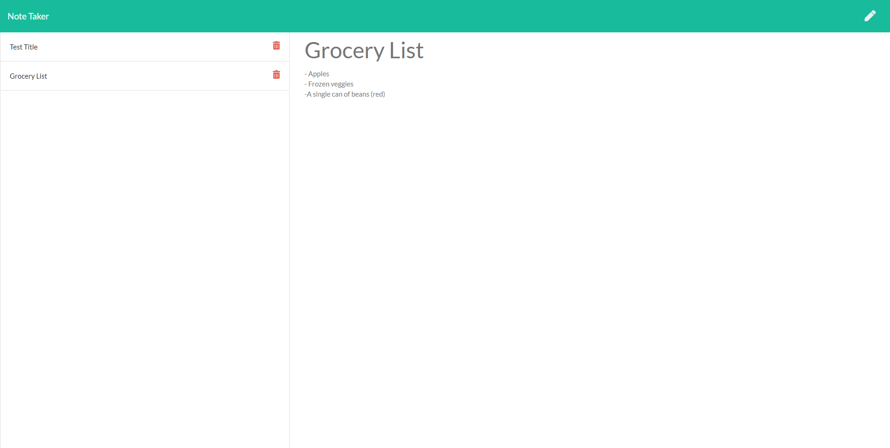

# Note Taker

## Description 

In an attempt to learn how to set up an express js server and sharpen my regular javascript troubleshooting skills I was given premade front end code and tasked with linking everything together into a functioning application.

## Table of Contents
- [Installation](#installation)
- [Usage](#usage)
- [License](#license)
- [Questions](#questions)

## Installation

[Live application available here!](https://dry-river-82057.herokuapp.com/)

## Usage

From the home page, click the get started button. User is then presented with previously saved notes to the left of the page and a form on the right. After entering a title and note body a save button appears allowing the note to be saved. Clicking on a saved note's title will display that note's body on the page. Clicking the pencil allows the user to enter a new note.

:

## License

MIT License

    Copyright (c) 2021 skelly1389
    
    Permission is hereby granted, free of charge, to any person obtaining a copy
    of this software and associated documentation files (the "Software"), to deal
    in the Software without restriction, including without limitation the rights
    to use, copy, modify, merge, publish, distribute, sublicense, and/or sell
    copies of the Software, and to permit persons to whom the Software is
    furnished to do so, subject to the following conditions:
    
    The above copyright notice and this permission notice shall be included in all
    copies or substantial portions of the Software.
    
    THE SOFTWARE IS PROVIDED "AS IS", WITHOUT WARRANTY OF ANY KIND, EXPRESS OR
    IMPLIED, INCLUDING BUT NOT LIMITED TO THE WARRANTIES OF MERCHANTABILITY,
    FITNESS FOR A PARTICULAR PURPOSE AND NONINFRINGEMENT. IN NO EVENT SHALL THE
    AUTHORS OR COPYRIGHT HOLDERS BE LIABLE FOR ANY CLAIM, DAMAGES OR OTHER
    LIABILITY, WHETHER IN AN ACTION OF CONTRACT, TORT OR OTHERWISE, ARISING FROM,
    OUT OF OR IN CONNECTION WITH THE SOFTWARE OR THE USE OR OTHER DEALINGS IN THE
    SOFTWARE. 

## Questions

For questions and comments reach out to me at:

Github: [skelly1389](https://github.com/skelly1389) 

Email: <invertedrdm@gmail.com>